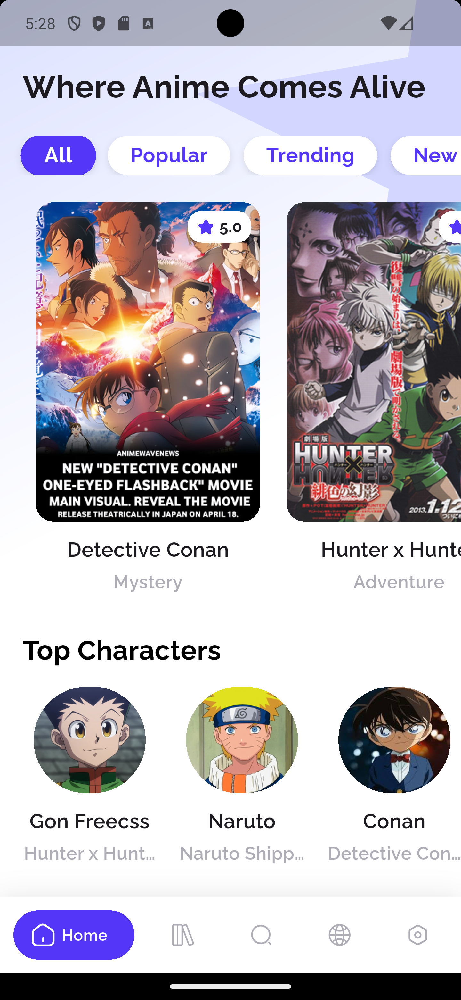
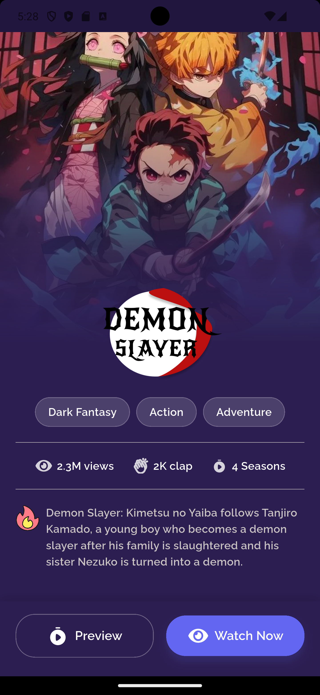

# Mimi App UI

Mimi App is a UI-focused Flutter project that showcases a modern and engaging interface for an anime streaming application. The project demonstrates a clean architecture for the UI layer, responsive design, and visually appealing screens for browsing, viewing details, and upgrading user plans.

## ✨ Features

- **Dynamic Home Page**: A vibrant home screen with a gradient background, filterable category chips (`All`, `Popular`, `Trending`), a horizontally scrolling list of featured anime, and a "Top Characters" section.
- **Immersive Detail Page**: An engaging anime detail screen with a full-bleed cover image, overlaid logo, genre tags, and key statistics like views, claps, and seasons.
- **Subscription Plan Page**: A clean, conversion-focused screen that presents monthly and annual subscription options with a hero illustration and clear call-to-action.
- **Custom Bottom Navigation**: A stylish and animated bottom navigation bar for easy access to different sections of the app.
- **Responsive Typography**: Text scales gracefully across different screen sizes using a custom responsive extension.
- **Well-Defined Theme**: Centralized constants for colors (`AppColors`) and text styles (`AppTextStyles`) ensure a consistent look and feel.
- **Organized Asset Management**: All image assets and custom fonts are neatly organized and referenced through a dedicated `AppAssets` class.

## 📱 App Screens

### 1. Home Page

The main landing screen that welcomes the user. It's designed for content discovery, featuring:

- A prominent title: "Where Anime Comes Alive".
- A horizontal list of category chips for filtering content.
- A carousel of large anime poster cards, each showing the title, genre, and a star rating.
- A horizontal list of circular avatars for "Top Characters."

### 2. Anime Detail Page

A rich, dark-themed screen that provides more information about a selected anime (`Demon Slayer` in the example). It includes:

- A large background image of the anime.
- The anime's logo positioned dynamically over the image.
- Genre tags (e.g., "Dark Fantasy", "Action").
- Statistics row with icons for views, claps, and seasons.
- A brief synopsis with a "fire" icon.
- "Preview" and "Watch Now" action buttons fixed at the bottom.

### 3. Upgrade Plan Page

A bright, encouraging screen designed to convert users to a premium plan. It features:

- A large "Rocket" illustration.
- A clear headline: "Seamless Anime Experience, Ad-Free."
- Selectable cards for "Monthly" and "Annually" subscription plans.
- A prominent "Continue" button.

### Demo Media

<p>
  <a href="https://drive.google.com/file/d/1Hjw9-ztQ9nY-6L84N3N3EJ4yGoZ1Y-qg/view?usp=sharing" target="_blank">
    ▶️ Watch on Google Drive
  </a>
</p>

## Screenshots (Mobile)

Images are stored at the repo root in `screenshots/`. The paths below are relative to this README:

<p >
  
  
 
</p>

<p >
  
  

</p>

<p >

  

</p>

## 🛠️ Tech Stack & Dependencies

- **Framework**: Flutter
- **State Management**: `bloc`
- **UI Components**: `google_nav_bar` for the bottom navigation bar.
- **Assets**: `flutter_svg` for rendering SVG images.
- **Utilities**: `equatable` for value equality.
- **Linting**: `flutter_lints` for maintaining code quality.
- **Font**: Raleway (custom font family included in assets).

## 📂 Project Structure

The project follows a clean feature-based architecture to keep the codebase organized and scalable.

```
lib
├── config/
│   ├── routing/        # App routing configuration
│   └── theme/          # Theming, colors, and text styles
├── core/
│   ├── constants/      # App-wide constants (assets, strings)
│   └── extension/      # Dart extensions (e.g., responsive_text)
├── features/home/
├── ├──data/
│   ├──├──datasources/
│   ├──├──models/
│   └──├── repositories/
├── ├── domain/
│   ├──├── entities/
│   ├──├── repositories/
│   └──├──usecases/
│   └──├── presentation/
│      │   ├── cubit/  # BLoC state management
│      │   ├── pages/  # Main screens/pages
│      │   └── widgets/# Reusable UI components
└── main.dart           # App entry point
```

## 🚀 Getting Started

To get a local copy up and running, follow these simple steps.

### Prerequisites

You need to have the Flutter SDK installed on your machine. For more information, refer to the [official Flutter documentation](https://flutter.dev/docs/get-started/install).

### Installation

1.  **Clone the repository:**

    ```sh
    git clone https://github.com/MohamedNaif/Mini-App-Ui-Only.git
    ```

2.  **Navigate to the project directory:**

    ```sh
    cd mini-app-ui-only
    ```

3.  **Install dependencies:**

    ```sh
    flutter pub get
    ```

4.  **Run the application:**
    ```sh
    flutter run
    ```
